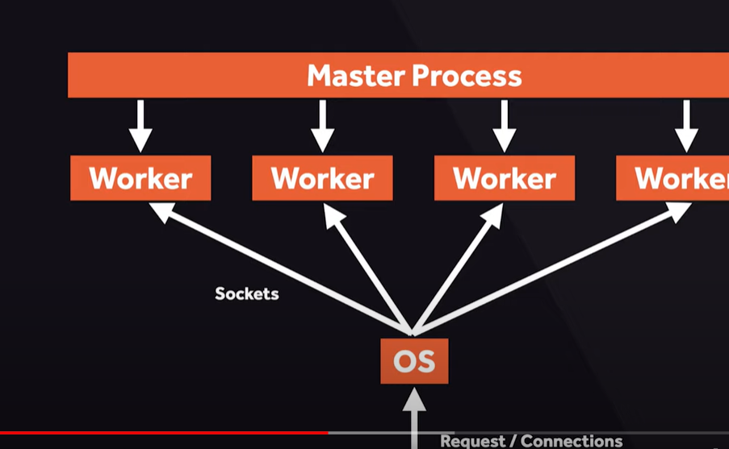
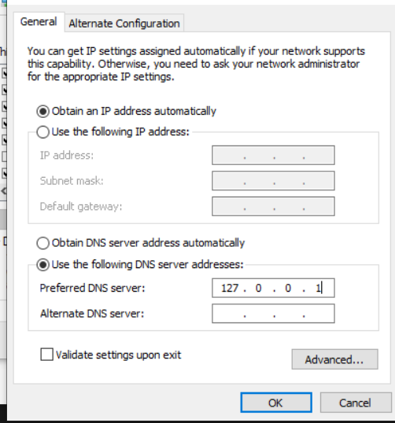

# nginx-config-setup

## Workaround NGINX and things to know

NGINX is open source software for web serving, reverse proxying, caching, load balancing, media streaming, and more

- Pull Image

```
docker pull nginx
```

- Setup container with name and port
  "-d" meaning detached which runs the container in the background

```
docker run -it --rm -d -p 8080:80 --name server-mgr nginx
```

- Container access bash

```
docker exec -it fc4f1fdbc2b4d44fb083301a837abddcaf1985778de7f28cb2ebbbcc02a36551 sh
```

NGINX cmds

Service cmds

```
service nginx start | stop
```

version and detailed version information

```
nginx -v | -V
```

Test configuration is ok or not

```
nginx -t | -T
```

nginx help

```
nginx -h
```

"-s" flag for signals to perform actions such as start/stop, restart

```
nginx -s stop
```

In docker with volumes you can map the local dir to img container

```
volumes:
      - ./html/:/usr/share/nginx/html #mapping the current html path to container path

```

Building img where we placed our file from current dir directly into the container dir read dockerfile

```
docker build -t webserver .
```

After the image is built with updating the container html file with our own we can create a new container out of it and run

```
>docker run -it --rm -d -p 8080:80 --name web webserver #where web is container name and webserver is image name from above
```

Docker navigate what processes are running within a container named "web" which was created from above cmd

```
docker top web
```

We can view the master and worker process labels from above cmd. i.e. because by default nginx spawns one master process with four worker processes.



The below package is added which is a linux package to navigate the running process

```
RUN apt-get update && apt-get install -y procps
```

- Notes related to nginx
  You can access the images, containers with their file dir assuming linux inst from docker extension in vscode

The below cmd displays all the running process with procps linux lib

```
ps -C nginx -f
```
Seen in CLI from above cmd


UID        PID  PPID  C STIME TTY          TIME CMD
root         1     0  0 10:54 pts/0    00:00:00 nginx: master process nginx -g daemon off;
nginx       30     1  0 10:54 pts/0    00:00:00 nginx: worker process
nginx       31     1  0 10:54 pts/0    00:00:00 nginx: worker process
nginx       32     1  0 10:54 pts/0    00:00:00 nginx: worker process
nginx       33     1  0 10:54 pts/0    00:00:00 nginx: worker process
nginx       34     1  0 10:54 pts/0    00:00:00 nginx: worker process
nginx       35     1  0 10:54 pts/0    00:00:00 nginx: worker process
nginx       36     1  0 10:54 pts/0    00:00:00 nginx: worker process
nginx       37     1  0 10:54 pts/0    00:00:00 nginx: worker process

- Master process controls the startup and shutdown or worker processes.
- Worker Process process the requests/serve connections.
- OS deliver the request using sockets to the worker processes.

One can view the worker processes in etc/nginx/nginx.conf
which means the 1024 connections can be handled by the worker connection that can changed acc. to traffic.

```
events {
    worker_connections  1024;
}
```

in the "etc/nginx/conf.d/default.conf" it consists of the configurations that needs to be updated acc. to docker file you can change root or index file as per your req.
```
location / {
        root   /usr/share/nginx/html/main;
        index  index.html index.htm;
    }
```


MINIMAL setup with local dns server for configuring locally.
- Overview:
Use of openrc in alpine based distro and service along with Dockerfile is created accordingly.
```
ports:
      - 53:53 #because DNS servers listen on port 53 for queries from DNS clients
      - 53:53/udp
```


Typically worker processes are assigned based on the cpu cores available i.e. detected with auto;

- #access_log  /var/log/nginx/host.access.log


### Set Your DNS server ip to 127.0.0.1
